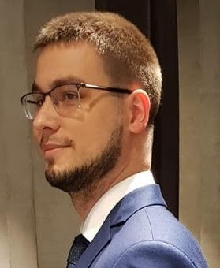

# PyPlatypus Creators

It is high time we introduced ourselves. We met while working on the R&D XAI-based project that was all about delivering the explainable automatic diagnosis of
x-ray hip joint images. Thereafter we have been working together occasionaly fueled by the passion for the one and only Computer Vision with a focus on medical data.
Our branching paths finally meets here and from their intersection the PyPlatypus was born.

## Michał Maj: maju116

I am data scientist with over 5 years of experience in the field, R/Shiny developer and a freelancer interested in deep/machine learning and statistics. I love challenges and I’m always ready to help solving data science problems. In my day to day work I am responsible for designing, testing and development of advanced deep and machine learning models in R and Python.

Find me at:

* [GitHub](https://github.com/maju116)

* [Linkedin](https://www.linkedin.com/in/michal-maj116/)

* [Blog](https://datascienceguts.com/)

## Jakub Borkowski: borkowski1110

For the time being I have been in existence in the Data Science World for over three years. The cornerstone of my experience will always remain the R&D Team Chionis that my colleagues and I founded during the studies.
From that point onward the major career aim of mine would always be to associate my occupation with Computer Vision and XAI technology. My interests caused me to delve into medtech, brand marketing and product ownership realms as well.

Find me at:

* [GitHub](https://github.com/borkowski1110)

* [Linkedin](https://www.linkedin.com/in/jrborkowski/)